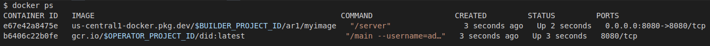

## Using docker SDK to launch a container from a container

A docker container which can pull and launch another container from some other registry.

This sample is nothing new and is documented as part of the Docker SDK:

- [Examples using the Docker Engine SDKs and Docker API](https://docs.docker.com/engine/api/sdk/examples/)
- [Pull an image with authentication](https://docs.docker.com/engine/api/sdk/examples/#pull-an-image-with-authentication)

The reason why I was looking for this  was to find a way a container could run another container _after_ it acquired credentials a remote registry.

In this example, we will have two different GCP projects:

1. Builder

  This project will author a simple HTTP server image and save it to its Artifact Registry

2. Operator
  
  This project will create a  docker image which will download the Builder's image and run it.   The builder's container image will run in a GCP project which does be given an access_token to access the builder's Artifact Registry. 
  Instead, the image the builder deploys will be given that access token to pull and deploy the builders image within the COS vm where the operator's VM runs


Basically the operator will run an image which is given the builders' access token to pull their image. 

The operator's image will pull the builders image and run it in the same Container Optimized VM where the operators project runs.

### Setup

You'll need two projects to test this demo:

### Builder

First setup the builder's image.  This is a simple http server

```bash
export BUILDER_PROJECT_ID=`gcloud config get-value core/project`
export BUILDER_PROJECT_NUMBER=`gcloud projects describe $BUILDER_PROJECT_ID --format='value(projectNumber)'`
export GCLOUD_USER=`gcloud config get-value core/account`

cd builder/
gcloud artifacts repositories create ar1 --repository-format=docker --location=us-central1

docker build -t us-central1-docker.pkg.dev/$BUILDER_PROJECT_ID/ar1/myimage:server .
docker push us-central1-docker.pkg.dev/$BUILDER_PROJECT_ID/ar1/myimage:server

# save an access token to the artifact registry.
export AR_TOKEN=`gcloud auth print-access-token`
```

### Operator 

The operator will build their launcher image.  

The launcher image is given three arguments:  the builder's image, an access token to pull that image and the username for the builder's artifact registry.

Normally, the operators's image will acquire this access token by any other means...in our case since its just a simple demo, we'll pass it as an argument.

```bash
export OPERATOR_PROJECT_ID=`gcloud config get-value core/project`
export OPERATOR_PROJECT_NUMBER=`gcloud projects describe $OPERATOR_PROJECT_ID --format='value(projectNumber)'`

cd operator/

### test pull locally which would fail
$ docker pull us-central1-docker.pkg.dev/$BUILDER_PROJECT_ID/ar1/myimage:server
Error response from daemon: Head "https://us-central1-docker.pkg.dev/v2/$BUILDER_PROJECT_ID/ar1/myimage/manifests/server": 
denied: Permission "artifactregistry.repositories.downloadArtifacts" denied on resource "projects/$BUILDER_PROJECT_ID/locations/us-central1/repositories/ar1" (or it may not exist)

## test running locally
go run main.go --username="$GCLOUD_USER" \
  --token=$AR_TOKEN \
  --image="us-central1-docker.pkg.dev/$BUILDER_PROJECT_ID/ar1/myimage:server"

### you should see the image running
$ docker ps
CONTAINER ID   IMAGE                                                      COMMAND     CREATED         STATUS         PORTS                    NAMES
7e88987d8655   us-central1-docker.pkg.dev/$BUILDER_PROJECT_ID/ar1/myimage   "/server"   3 seconds ago   Up 2 seconds   0.0.0.0:8080->8080/tcp   thirsty_moser

curl -v http://localhost:8080/

# now build the operator's image
docker build -t gcr.io/$OPERATOR_PROJECT_ID/did:latest .

# run via docker locally
docker run -v /var/run/docker.sock:/var/run/docker.sock gcr.io/$OPERATOR_PROJECT_ID/did:latest \
   --username="$GCLOUD_USER" \
  --token=$AR_TOKEN \
  --image="us-central1-docker.pkg.dev/$BUILDER_PROJECT_ID/ar1/myimage:server"

# you will see the image you just ran ** AND *** the builder's image
$ docker ps
CONTAINER ID   IMAGE                                                      COMMAND                  CREATED         STATUS         PORTS                    NAMES
e67e42a8475e   us-central1-docker.pkg.dev/$BUILDER_PROJECT_ID/ar1/myimage   "/server"                3 seconds ago   Up 2 seconds   0.0.0.0:8080->8080/tcp   condescending_bohr5
b6406c22b0fe   gcr.io/$OPERATOR_PROJECT_ID/did:latest                      "/main --username=ad…"   3 seconds ago   Up 3 seconds   8080/tcp                 quirky_lederberg
```




```bash
## push to registry
docker push gcr.io/$OPERATOR_PROJECT_ID/did:latest

#  allow firewall rule for the our builder's webserver
gcloud compute firewall-rules create allow-ingress-for-testing  \
   --direction=INGRESS   --action=allow   --rules=tcp:8080   --source-ranges=0.0.0.0/0

# launch container vm and only specify the operator's VM
### again, since this is just a demo, we're passing the access_token in as an argument
gcloud compute instances create-with-container instance-2  \
    --zone=us-central1-a \
       --service-account=$OPERATOR_PROJECT_NUMBER-compute@developer.gserviceaccount.com  \
         --scopes=https://www.googleapis.com/auth/devstorage.read_only  \
           --image=projects/cos-cloud/global/images/cos-stable-101-17162-40-13 \
           --container-image=gcr.io/$OPERATOR_PROJECT_ID/did:latest   \
           --container-mount-host-path=host-path=/var/run/docker.sock,mode=rw,mount-path=/var/run/docker.sock \
           --container-arg="--token=$AR_TOKEN" \
           --container-arg="--username=$GCLOUD_USER" \
           --container-arg="--image=us-central1-docker.pkg.dev/$BUILDER_PROJECT_ID/ar1/myimage:server"

```

You can verify the builder's image is up and running by accessing the public api of the VM over port 8080.


---


